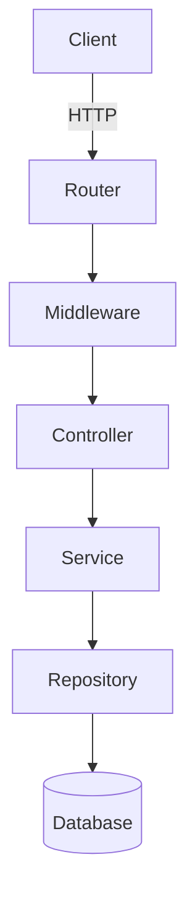
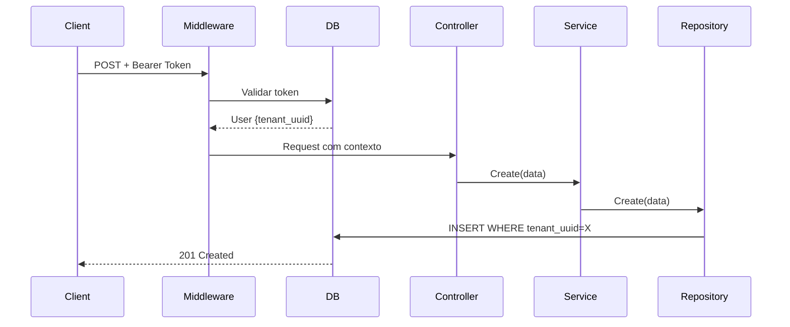

## 📁 Estrutura do Projeto

```
crud-tenant-simply/
├── cmd/                           # Ponto de entrada da aplicação
│   ├── bootstrap/                 # Inicialização de dependências
│   ├── cli/                       # CLI commands
│   └── server/                    # Servidor HTTP
│       └── routes/                # Configuração de rotas
├── internal/                      # Código privado da aplicação
│   ├── iam/                       # Identity and Access Management
│   │   ├── application/           # Casos de uso
│   │   │   └── auth/              # Autenticação, login, OTP
│   │   ├── domain/                # Camada de domínio
│   │   │   ├── model/             # Entidades compartilhadas
│   │   │   │   ├── tenant.go      # Entidade Tenant
│   │   │   │   └── user.go        # Entidade User
│   │   │   ├── tenant/            # Domínio Tenant
│   │   │   │   ├── controller.go  # Endpoints HTTP
│   │   │   │   ├── service.go     # Regras de negócio
│   │   │   │   ├── repository.go  # Acesso a dados
│   │   │   │   ├── dto_request.go # DTOs de entrada
│   │   │   │   ├── dto_response.go# DTOs de saída
│   │   │   │   ├── errors.go      # Erros específicos
│   │   │   │   └── singleton.go   # Padrão singleton
│   │   │   └── user/              # Domínio User (estrutura similar)
│   │   └── middleware/            # Middlewares
│   │       ├── middleware.go      # Autenticação/Autorização
│   │       ├── repository.go      # Acesso a tokens
│   │       └── util.go            # Funções auxiliares
│   ├── infra/                     # Infraestrutura
│   │   ├── database/              # PostgreSQL
│   │   │   ├── migrations/        # Scripts SQL
│   │   │   └── postgres/          # Conexão
│   │   └── jwt/                   # Geração/validação JWT
│   └── pkg/                       # Pacotes compartilhados
│       ├── mailer/                # Envio de e-mails
│       ├── rest_err/              # Padronização de erros HTTP
│       ├── system/                # Configurações do sistema
│       └── util/                  # Utilitários
├── docs/                          # Documentação Swagger
├── configs.json                   # Configurações da aplicação
├── go.mod                         # Dependências Go
└── main.go                        # Entry point
```

### Detalhamento dos Diretórios

#### `/cmd`
Contém o código de inicialização e entry point da aplicação.

- **`bootstrap/`**: Inicializa database, JWT, mailer
- **`cli/`**: Comandos CLI (server, migrations)
- **`server/routes/`**: Configuração de rotas HTTP

#### `/internal/iam`
Identity and Access Management - gerenciamento de identidade.

- **`application/auth/`**: Login, OTP, geração de tokens
- **`domain/model/`**: Entidades compartilhadas entre domínios
- **`domain/tenant/`**: CRUD completo de Tenants
- **`domain/user/`**: CRUD completo de Users
- **`middleware/`**: Autenticação JWT e autorização por roles

#### `/internal/infra`
Implementações de infraestrutura.

- **`database/migrations/`**: Scripts SQL seed/update
- **`database/postgres/`**: Conexão GORM
- **`jwt/`**: Funções de criação/validação de tokens

#### `/internal/pkg`
Pacotes reutilizáveis.

- **`rest_err/`**: Padronização de erros HTTP (400, 404, 500...)
- **`mailer/`**: Envio de e-mails SMTP
- **`system/`**: Carregamento de configs
- **`util/`**: Funções auxiliares gerais

### Como Criar Novo Módulo

Para criar um novo módulo (ex: `product`), siga o padrão existente:

```
internal/iam/domain/product/
├── controller.go       # Endpoints HTTP
├── service.go          # Lógica de negócio
├── repository.go       # Acesso ao banco
├── dto_request.go      # Estruturas de request
├── dto_response.go     # Estruturas de response
├── errors.go           # Erros customizados
├── model.go            # Tipos auxiliares
└── singleton.go        # Padrão singleton para injeção
```

---

## 🚀 Requisitos e Instalação

### Pré-requisitos

- **Go 1.25+**
- **PostgreSQL 14+**
- **Git**

### Instalação

#### 1. Clonar o Repositório
```bash
git clone <repository-url>
cd crud-tenant-simply
```

#### 2. Configurar Variáveis de Ambiente

Copie o arquivo de exemplo:
```bash
cp configs.json.example configs.json
```

Edite `configs.json`:
```json
{
  "app": {
    "env": "dev",
    "name": "crud-tenant-simply"
  },
  "security": {
    "jwt_access_secret": "YOUR_SECRET_HERE",
    "jwt_refresh_secret": "YOUR_REFRESH_SECRET",
    "jwt_access_expiry_min": 15
  },
  "server": {"http": {"port": "8080"}},
  "databases": {
    "postgres": {
      "host": "127.0.0.1",
      "port": 5432,
      "user": "admin",
      "pwd": "password",
      "db_name": "crud_multitenant",
      "ssl_mode": "disable"
    }
  }
}
```

#### 3. Instalar Dependências
```bash
go mod download
```

#### 4. Executar Migrations

Crie o database:
```bash
createdb crud_multitenant
```

Execute migrations manualmente ou via aplicação.

#### 5. Iniciar Servidor
```bash
go run main.go server
```

Acesse Swagger: `http://localhost:8080/doc/index.html`

---

## 🔄 Fluxo de Requisições

### Exemplo: Criar Tenant

**Request:**
```http
POST /api/tenant/create HTTP/1.1
Authorization: Bearer eyJhbGc...
Content-Type: application/json

{"name": "Empresa ABC", "document": "12345678901234"}
```

**Fluxo:**

```
HTTP Request → Router → Middleware (Auth) → Controller → Service → Repository → DB
```

1. **Middleware** valida token, injeta user no contexto
2. **Controller** bind JSON → DTO, valida
3. **Service** aplica regras de negócio
4. **Repository** executa INSERT
5. **Response** retorna 201 Created

---

## 📐 Padrões Adotados

### DTOs
```go
type CreateTenantRequestDto struct {
    Name     string `json:"name"`
    Document string `json:"document"`
}
```

### Retornos HTTP

| Código | Uso |
|--------|-----|
| 200 | Sucesso (leitura) |
| 201 | Criado |
| 204 | Sem conteúdo (delete) |
| 400 | Bad Request |
| 401 | Não autenticado |
| 403 | Não autorizado |
| 404 | Não encontrado |
| 409 | Conflito |
| 500 | Erro interno |

### Singleton

```go
func Use() (*controllerImpl, error) {
    once.Do(func() {
        db := postgres.MustGet()
        repo := NewRepository(db.GetDB())
        svc := NewService(repo)
        mw, _ := middleware.Use()
        instance = NewController(svc, mw).(*controllerImpl)
    })
    return instance, nil
}
```

---

## 🛠️ Guia de Extensão

### Criar Novo Domínio

**1. Criar Modelo:**

```go
// internal/iam/domain/model/product.go
type Product struct {
    UUID       uuid.UUID  `gorm:"type:uuid;primaryKey"`
    TenantUUID uuid.UUID  `gorm:"type:uuid;not null;index"` // Multitenant!
    Name       string     `gorm:"type:varchar(255)"`
    Price      float64    `gorm:"type:decimal(10,2)"`
    CreateAt   time.Time  `gorm:"autoCreateTime"`
}
```

**2. Criar Repository, Service, Controller** seguindo padrão de `tenant/` ou `user/`.

**3. Registrar Rotas** em `cmd/server/routes/routes.go`.

---

## 💡 Exemplos Práticos

### Criar Tenant
```bash
curl -X POST http://localhost:8080/api/tenant/create \
  -H "Authorization: Bearer <TOKEN>" \
  -H "Content-Type: application/json" \
  -d '{"name": "Empresa XYZ", "document": "98765432100001"}'
```

### Login
```bash
curl -X POST http://localhost:8080/api/auth/login \
  -d '{"email": "user@empresa.com", "password": "senha123"}'
```

### Frontend (React)
```javascript
const response = await fetch('http://localhost:8080/api/tenant/create', {
  method: 'POST',
  headers: {
    'Authorization': `Bearer ${token}`,
    'Content-Type': 'application/json',
  },
  body: JSON.stringify({name: 'Empresa', document: '123'}),
});
```

---

## 📖 Glossário

- **Tenant**: Cliente/organização com dados isolados
- **Domínio**: Agregação de funcionalidades (tenant, user, product)
- **Use Case**: Caso de uso implementado no Service
- **DTO**: Data Transfer Object (sem lógica)
- **Repository**: Camada de acesso a dados
- **Controller**: Recebe HTTP, chama Service
- **Service**: Contém regras de negócio
- **Multitenancy**: Arquitetura de múltiplos clientes isolados

---

## 📊 Diagramas

### Arquitetura



### Fluxo Multitenant



---

## ✅ Checklist

-[ ] Clone repositório
- [ ] Configure `configs.json`
- [ ] Execute migrations
- [ ] Inicie servidor
- [ ] Acesse Swagger `/doc/index.html`
- [ ] Teste autenticação
- [ ] Leia domínios existentes
- [ ] Crie novo domínio

---

**Versão**: 1.0.0 | **Arquitetura**: Clean Architecture + Multitenancy | **Stack**: Go 1.25 + Gin + GORM + PostgreSQL
